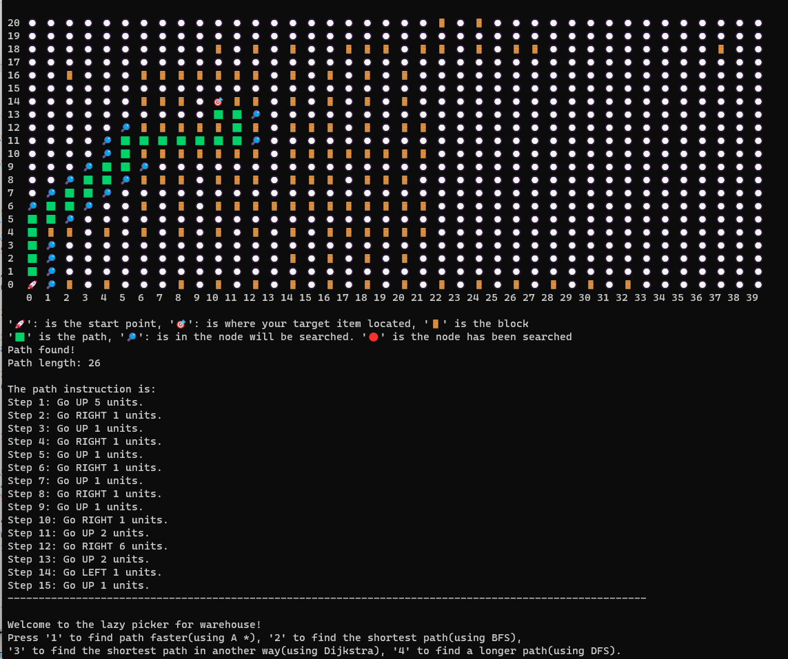

# Lazy Picker (Alpha Release)
## Introduction

Lazy Picker Alpha is a program to solve the path finding problem. It will display the overall map with shelf locations to the user. The user needs to input one of any existing product ID and choose what algorithm(A*, BFS, Dijkstra, DFS) they want to run, the program will output: the path on the map, the direction texts, and the total step the path takes. 

## Modules and Files

- `README.txt`
- `lazy_picker.py`: This is the main module for importing data, building the map structure, and the main function is inside this module.
- `data.py`: This module is a helper module of lazy_picker.py used to call specific components from the map.
- `entities.py`: This module is a helper module of data.py used for classifying the components in a map.
- `service.py`: This module is mainly for visualizing the map and storing the algorithms.
- `test.py`: This module is an example of using the libraries.
- `qvBox-warehouse-data-s23-v01.txt`: QVWEP's warehouse map.

## Example:

